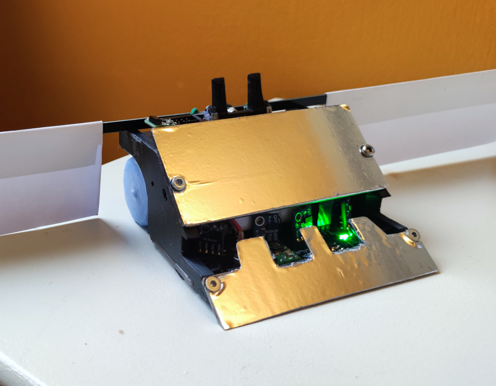
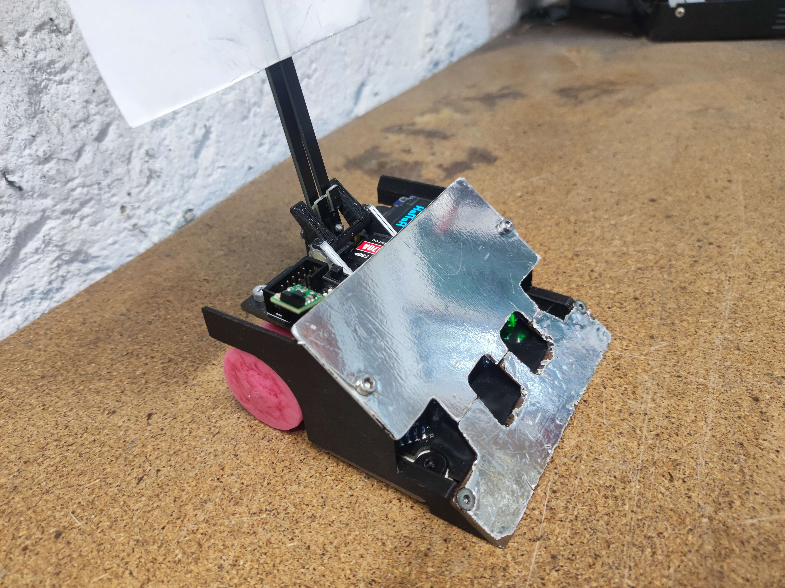
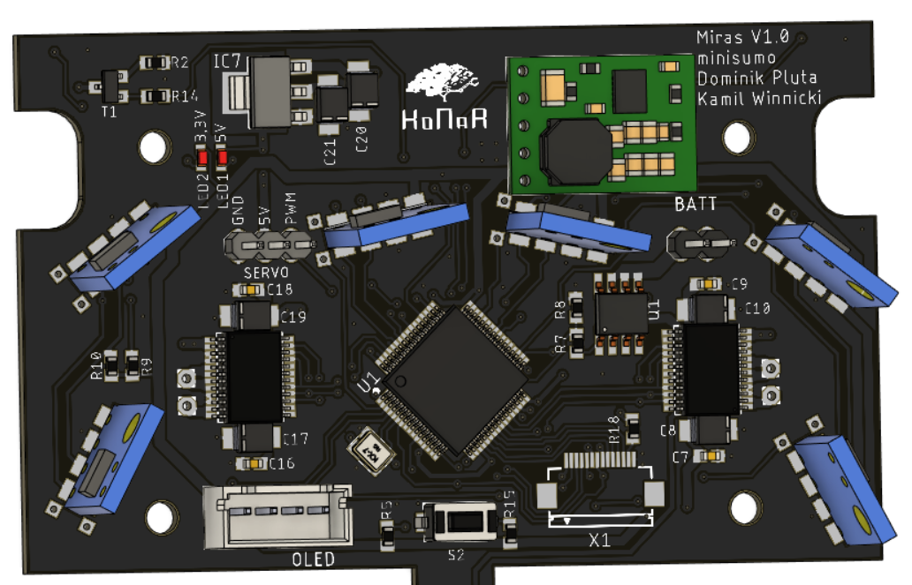

# Miras

### Autonomous minisumo robot
Based around an STM32 microcontroller and VL53L0X TOF(time of flight) distance sensors, which provide necessary processing power and great detection range of opponents.

## Used tools:
 &nbsp;&nbsp;&nbsp;&nbsp; &nbsp;&nbsp;&nbsp;&nbsp; 
 &nbsp;&nbsp;&nbsp;&nbsp; &nbsp;&nbsp;&nbsp;&nbsp; 

#

## Authors:

1. [**Dominik Pluta**](https://github.com/Dominik-Workshop):
   - Responsibility: PCB design, programming
2. [**Kamil Winnicki**](https://github.com/KamilWuu):
   - Responsibility: design and manufacturing of mechanical parts

## Special thanks

Special thanks to [**Eryk Możdzeń**](https://github.com/Eryk-Mozdzen), who helped with programming.