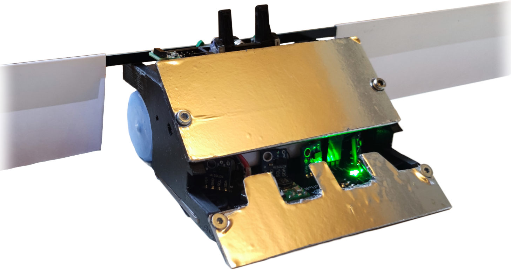
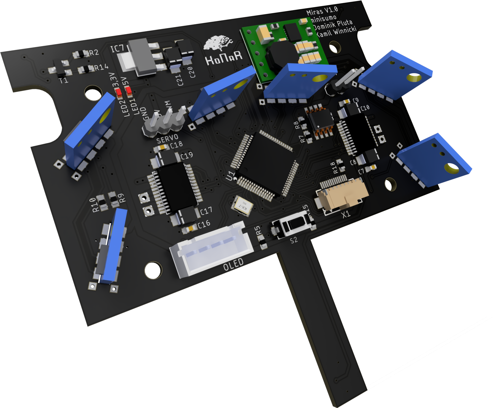
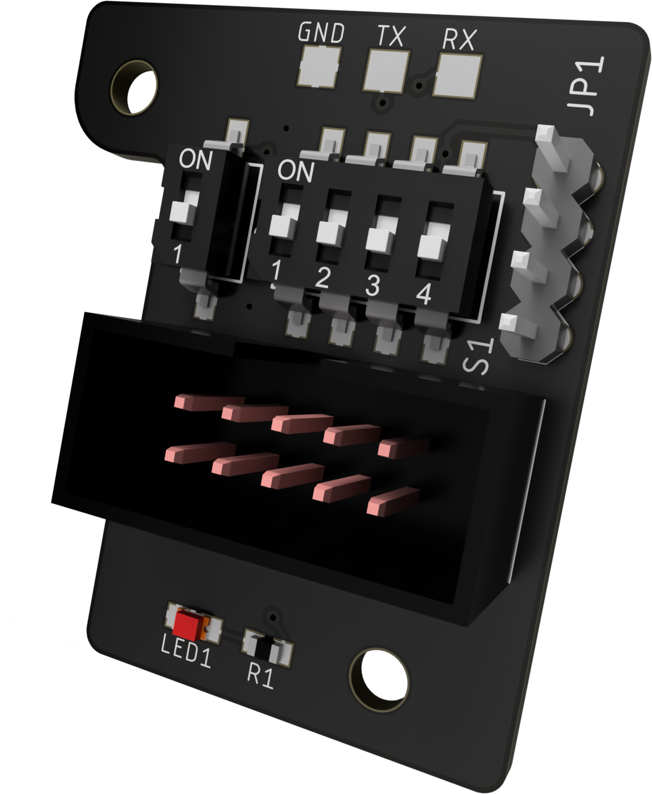
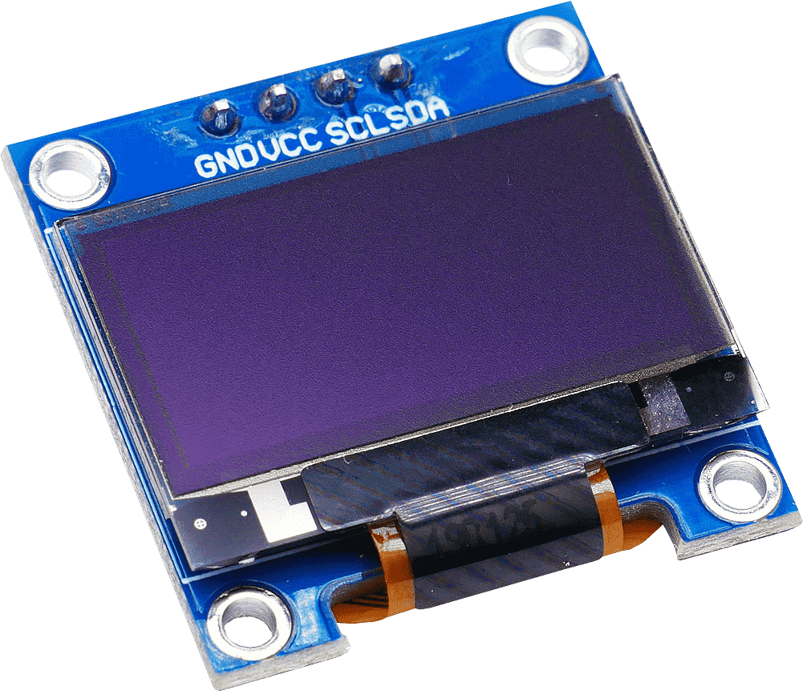
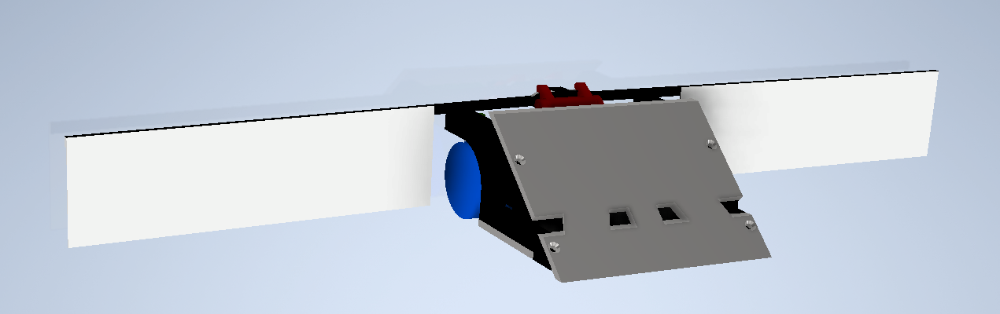
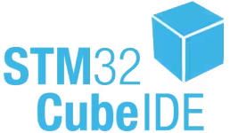

# Miras

 

## Overview

Autonomous minisumo robot, based around an **STM32** microcontroller and **VL53L0X** TOF (time of flight) distance sensors, which provide necessary processing power and great detection range of opponents.

Its distinguishing feature is a set of **deployable wings**, designed to attract an opponent toward them, making them vulnerable to falling off the dohyo.

## Electronics

This project features two custom-designed PCBs that are connected via a flexible flat cable (FFC):

- [**Main board**](/pcb_main/): responsible for the robot's core functionalities. It integrates the microcontroller, sensors, motor drivers, and power management circuitry

  

- [**Top board**](/pcb_top/): accommodates an on/off switch, an SWD programming connector, configuration DIP switches, and a dedicated space for a standard [starter module](https://p1r.se/startmodule/)

   

The robot also features a 128x64px **OLED** screen for debugging.

   

## Mechanical

  

The chassis is a robust blend of 3D-printed components, steel, and aluminum, designed for durability and a low center of gravity. For superior traction on the dohyo, the robot is equipped with custom cast rubber tires. The unique deployable wings, made from lightweight paper, serve as the active deflection mechanism.

The robot is powered by two **N20** motors.

## Used Tools

 &nbsp;&nbsp;&nbsp;&nbsp; &nbsp;&nbsp;&nbsp;&nbsp;
 &nbsp;&nbsp;&nbsp;&nbsp; &nbsp;&nbsp;&nbsp;&nbsp;

## Authors

- [**Dominik Pluta**](https://github.com/Dominik-Workshop):
  - **Responsibility**: PCB design, programming
- [**Kamil Winnicki**](https://github.com/KamilWuu):
  - **Responsibility**: design and manufacturing of mechanical parts

## Special Thanks

Special thanks to [**Eryk Możdzeń**](https://github.com/Eryk-Mozdzen), who helped with programming.
